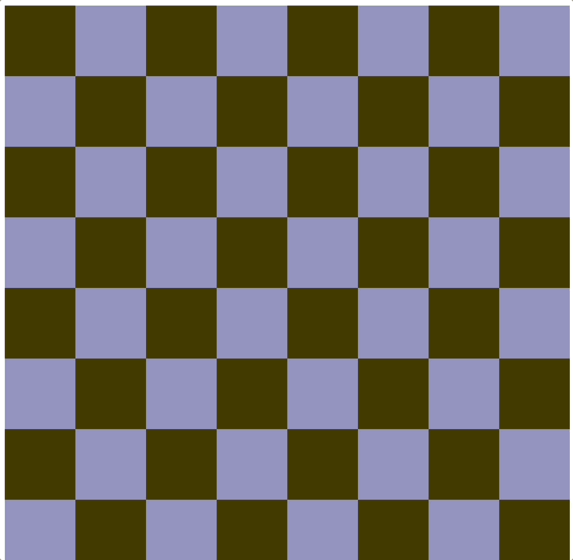

# Minimal zig-wasm-canvas example

A minimal example showing how HTML5's canvas, wasm memory and zig can interact.

https://daneelsan.github.io/minimal-zig-wasm-canvas/



This example was mostly adapted from: https://wasmbyexample.dev/examples/reading-and-writing-graphics/reading-and-writing-graphics.rust.en-us.html. The difference (aside from using Zig instead of Rust), is that this example
does not depend on any external package, library or extra bindings. As with most Zig related projects, the `zig` command is everything you will need.

## Summary

`checkerboard.zig` defines a global 8 by 8 pixel array: `checkerboard_buffer`.
There are two functions exported: `getCheckerboardBufferPointer()` and `colorCheckerboard(...)`.
`getCheckerboardBufferPointer()` returns a pointer to the start of `checkerboard_buffer`, which will be used inside `script.js` (described later). The other function, `colorCheckerboard(...)`, is in charge of (re-)coloring the different squares in the checkerboard according to colors passed down by `script.js`.

`checkerboard.zig` is compiled into the wasm module `checkerboard.wasm` by `build.zig` (see the [Build Section](#build)).

`script.js` first creates a [WebAssembly.Memory](https://developer.mozilla.org/en-US/docs/Web/JavaScript/Reference/Global_Objects/WebAssembly/Memory), named `memory`, which will be used by the wasm module's memory. Next step is to compile and instantiate the fetched wasm module using [WebAssembly.instantiateStreaming()](https://developer.mozilla.org/en-US/docs/Web/JavaScript/Reference/Global_Objects/WebAssembly/instantiateStreaming). The returned object is a [Promise](https://developer.mozilla.org/en-US/docs/Web/JavaScript/Reference/Global_Objects/Promise) which contains the `instance` field ([WebAssembly.Instance](https://developer.mozilla.org/en-US/docs/Web/JavaScript/Reference/Global_Objects/WebAssembly/Instance)). This is where all the exported symbols from `checkerboard.wasm` will be stored.

What follows is mostly straightforward:

-   Create a _Uint8Array_ from the WebAssembly.Memory `memory` buffer, called `wasmMemoryArray`.
-   Get the `"checkerboard"` canvas defined in `index.html` and create an [ImageData](https://developer.mozilla.org/en-US/docs/Web/API/ImageData) object from the canvas' context, called `imageData`.
-   In a loop:
    -   Call `colorCheckerboard(...)`, passing down random RGB colors. This will modify the values inside `checkerboard_buffer`.
    -   Extract the contents of the `checkerboard_buffer`, which is an slice of `wasmMemoryArray` offseted by `getCheckerboardBufferPointer()` and of length `8 * 8 * 4` (bytes).
    -   Copy the contents of the previous slice, i.e. the contents of `checkerboard_buffer`, into the `imageData`'s data.
    -   Put the `imageData` into the canvas.

## Build

The default (and only) target for this example is `wasm32-freestanding-musl`.

The latest zig version used to build this project is:
```shell
$ zig version
0.12.0-dev.2341+92211135f
```

To build the wasm module, run:

```shell
$ zig build

$ ls zig-out/lib/ checkerboard.*
checkerboard.wasm

$ wc -c zig-out/bin/checkerboard.wasm 
580 zig-out/bin/checkerboard.wasm
```

Note: `build.zig` specifies various wasm-ld parameters. For example, it sets the initial memory size
and maximum size to be 2 pages, where each page consists of 64kB. Use the `--verbose` flag to see the complete list of flags the build uses.

## Run

Start up the server in this repository's directory:

```shell
python3 -m http.server
```

Go to your favorite browser and type to the URL `localhost:8000`. You should see the checkboard changing colors.

## Resources

-   https://developer.mozilla.org/en-US/docs/WebAssembly/Using_the_JavaScript_API
-   https://github.com/ern0/howto-wasm-minimal
-   https://wasmbyexample.dev/examples/reading-and-writing-graphics/reading-and-writing-graphics.rust.en-us.html
-   https://radu-matei.com/blog/practical-guide-to-wasm-memory/
